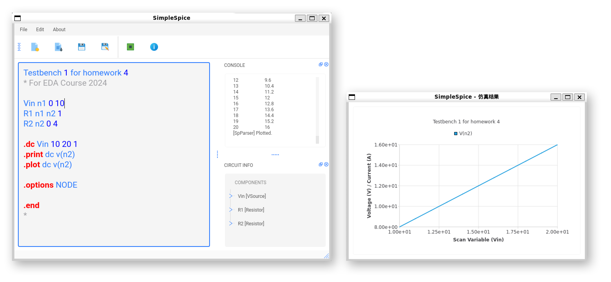
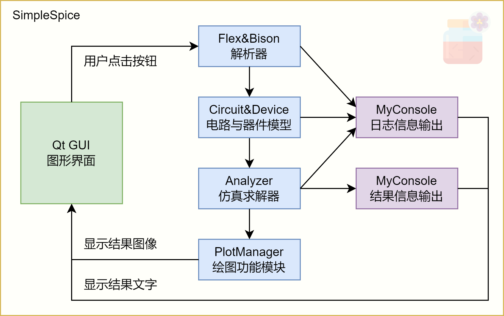
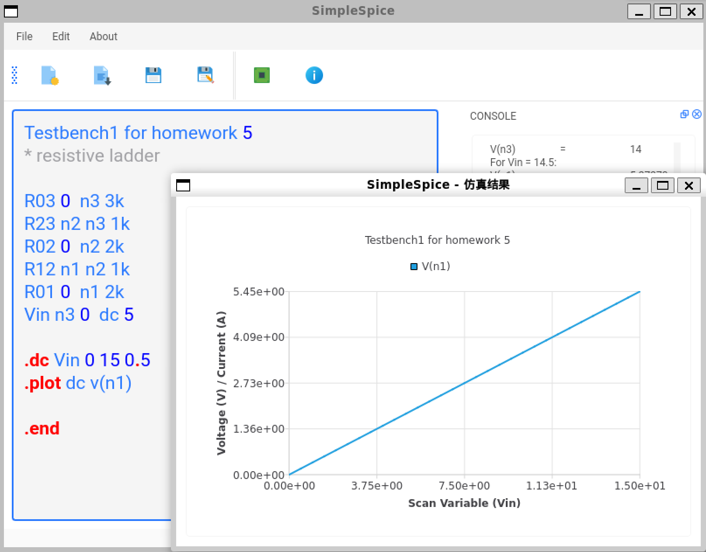
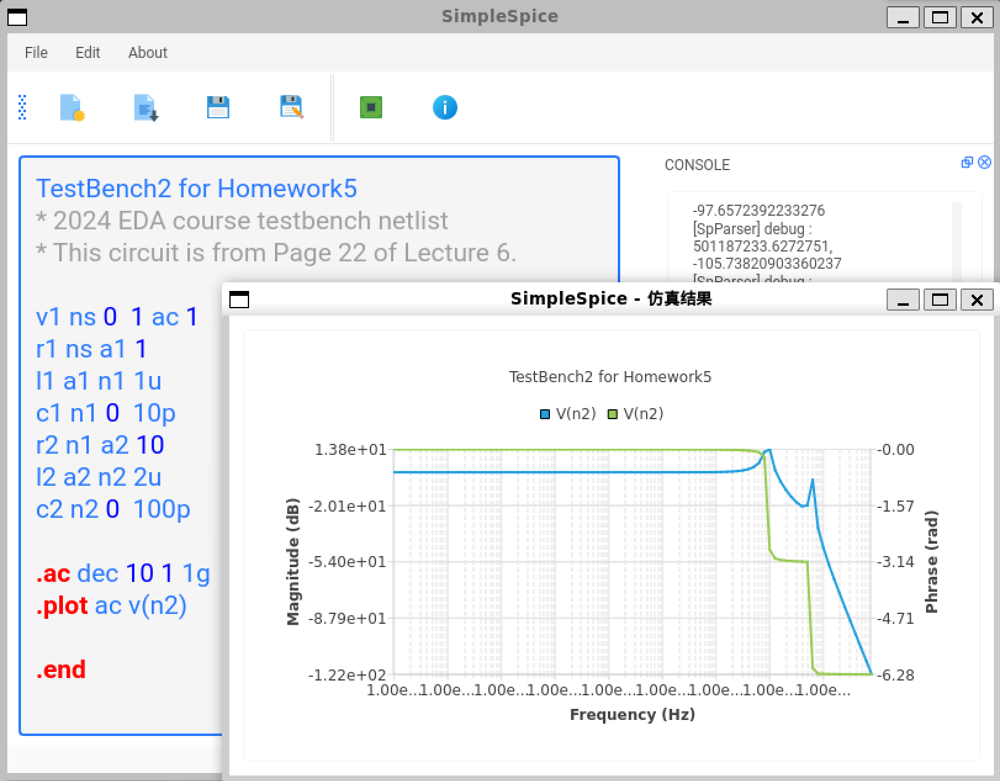
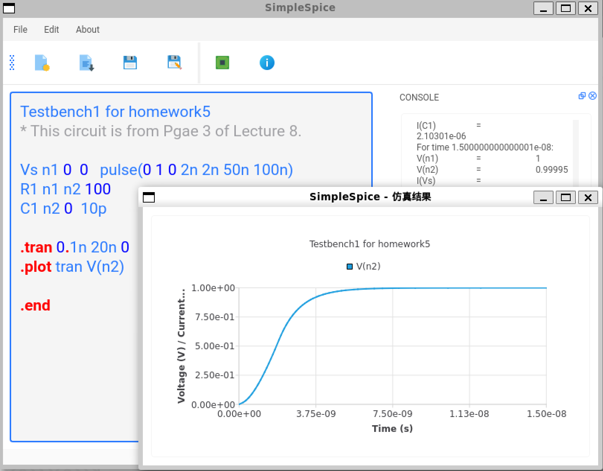
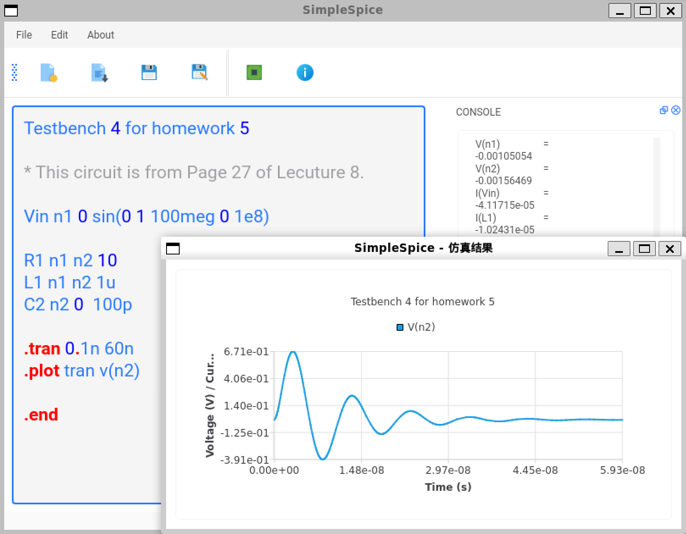
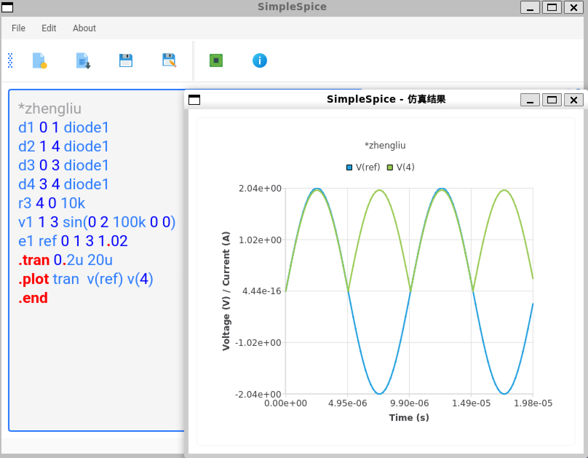

##  SimpleSpice
### 简介
**本项目为 2024秋 MST4307 设计自动化引论 课程大作业**

本项目旨在开发一个集成电路仿真器，初探 EDA（电子设计自动化）领域的技术知识和路线。项目采用了 C++ 语言结合 Qt GUI 框架、Flex & Bison 工具，以及 Qt Charts 库，构建了一个名为 SimpleSpice 的集成电路仿真器。该仿真器不仅支持对电路进行非线性直流（DC）、交流（AC）和瞬态（TRAN）分析，还提供了友好的用户界面，包括图形化显示仿真结果曲线、电路网表解析、以及错误处理机制。

SimpleSpice 的总体架构如下图所示，用户首先通过 GUI 打开文件，然后点击解析按钮，Flex & Bison 解析器将网表文件解析为 C++ 类承载的电路与器件模型，然后仿真求解器根据网表文件中的命令进行求解。仿真的文字结果（如 print 命令）交给 MyConsole 显示在 GUI 界面上，图像结果（如 plot 命令）由绘图功能模块生成 Qt Charts 图像，以窗口形式显示。

### 功能
#### 显示、操作与交互
- 支持文件操作功能（新建、打开、保存、另存为）
- 编辑框支持简单的 .sp 文件语法高亮（注释、数字与 command）
- 能图形化输出仿真结果曲线，并准确显示坐标度量（支持线性坐标和对数坐标）
- 主界面各个部分为响应式布局，支持调整大小和位置

#### 电路网表解析
- 使用Flex&Bison构建网表解析器，能读入并解析HSPICE兼容的基本电路网表
- 支持以下元件的解析：电阻(R)，电容(C)，电感(L)，独立电流源/电压源(I，V)，四种受控源（E, F, G, H），二极管（D）、晶体管（M）
- 支持以下命令的解析：.title、.op、.print、.dc、.ac、.tran、.options（node、list）、.plot，均支持出现多次
- 支持弹窗显示解析错误信息

#### 电路仿真
- 能顺利完成所有助教提供的基本测试电路的仿真和一些自主测试电路的仿真
- 支持仿真过程信息、结果信息、调试信息等输出到图形界面
- 支持以下元件的电路直流工作点分析（OP）、单参数直流扫描（DC）、频率响应分析（AC）、时域瞬态响应仿真（TRAN）：电阻（R），电容（C），电感（L），独立电流源/电压源（I, V），四种受控源（E, F, G, H），二极管（D）、晶体管（M）
- 非线性元件使用牛顿迭代法求解，其中二极管支持 Limiting 技术
- 对部分测试电路，SimpleSpice 仿真结果与 HSPICE 进行对照，误差在优秀的范围内
- 支持 LTE 步长控制

#### 支持的网表格式
| 元件/命令      | 网表格式                                                | 说明                                                                             |
|----------------|---------------------------------------------------------|----------------------------------------------------------------------------------|
| 电阻           | Rname n1 n2 value                                       | value支持使用科学计数法，下同                                                    |
| 电容           | Cname n+ n- value                                       | /                                                                                |
| 电感           | Lname n+ n- value                                       | /                                                                                |
| 电流源         | Iname n+ n- <<DC> DC/TRAN VALUE> <AC <ACMAG <ACPHASE>>> | 支持正弦（SIN(VO VA FREQ TD THETA)）和脉冲（PULSE(V1 V2 TD TR TF PW PER)）电流源 |
| 电压源         | Vname n+ n- <DC<> DC/TRAN VALUE> <AC <ACMAG <ACPHASE>>> | 支持正弦（SIN(VO VA FREQ TD THETA)）和脉冲（PULSE(V1 V2 TD TR TF PW PER)）电压源 |
| 压控电压源     | Ename n+ n- nc+ nc- value                               | /                                                                                |
| 压控电流源     | Gname n+ n- nc+ nc- value                               | /                                                                                |
| 流控电压源     | Hname n+ n- nc+ nc- value                               | /                                                                                |
| 流控电流源     | Fname n+ n- nc+ nc- value                               | /                                                                                |
| 二极管         | Dname n+ n- Mname                                       | /                                                                                |
| 晶体管         | Mname ND NG NS NB MNAME <L=VAL> <W=VAL>                 | L默认1u，W默认1u                                                                 |
| 直流工作点分析 | .OP                                                     | /                                                                                |
| 直流扫描分析   | .DC var start stop step                                 | 仅支持单变量扫描                                                                 |
| 交流分析       | .AC type np fstart fstop                                | /                                                                                |
| 时域分析       | .TRAN tstep tstop <tstart>                              | /                                                                                |
| 输出文字信息   | .PRINT antype ov1 [ov2 …]                               | /                                                                                |
| 绘制图像       | .PLOT antype ov1 [ov2 …]                                | /                                                                                |
| 选项           | .OPTION NODE  .OPTION LIST                           | 输出节点列表    输出器件列表                                                    |

### 部分测试电路

### 构建
- 使用 QtCreator（推荐）
- 使用命令行
    1. `qmake .`
    2. `make`
    3. `./test`
